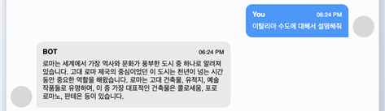

# AAI-AGAIN  
[데모 링크](https://6dfa26a6fd3bfb6a31.gradio.live)

### 작품 개요
- 많은 빅테크 기업과 연구소는 한국어 기반 LLM을 출시하고 있지만 그에 따른 성능은 그다지 좋지 못한 편이다.
- 이에 따라 사용자의 의도를 파악하고 응답하는 한국어, 영어 기반 Multi-lingual LLM을 개발한다.
- 사용자의 편의성을 위해 해당 LLM을 Gradio를 활용해 웹 어플리케이션으로 배포한다  

### 최종 목표  
- 적은 자원으로도 효과적으로 한국어 성능을 향상시키는 방법론을 토대로 Multi-lingual LLM을 개발한다.
- 동일한 크기의 LLM 성능 SOTA 달성
- 사용자의 편의성을 위해 LLM을 웹 어플리케이션을 배포한다.

  
   
  <b>모델 아키텍쳐</b>

  
   
  <b>챗봇 응답 시스템</b>

### 기대효과 및 활용방안
● 한국어에 대해 자연스러운 답변과 생성을 가능케하여 유용하고 맞춤화된 정보와 답변을 얻을 수 있다.  
● LLM 웹 어플리케이션을 통해 한국어, 영어로 된 다양한 주제에 대해 질문, 설명, 가이드 등을 제공하여 학습과 정보 습득에 도움을 줄 수 있다.  
● 해당 모델을 이용하여 차후 특정 Domain(ex. STEM, 의료, 법률 등)에 대해 fine-tuning을 진행하여  특정 분야에 특화된 LLM을 개발할 수 있다.  

### 작품의 특징  

  
   
  <b>GPT-4를 활용한 타 한국어 기반 LLM 과의 답변 생성 능력 평가 - 모델 업로드 기준(23년 10월) SOTA달성</b>

  
   
  <b>Gradio를 활용한 웹 어플리케이션</b>

