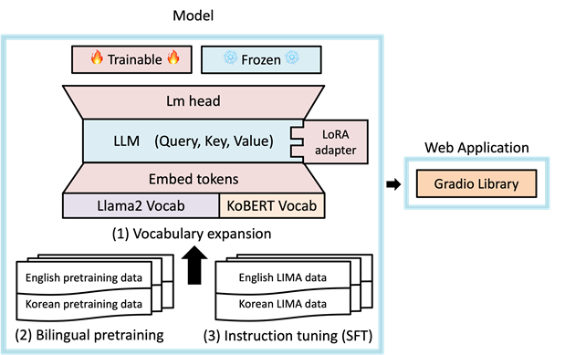
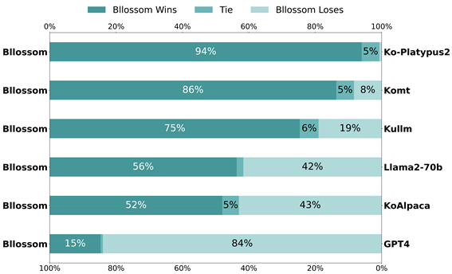
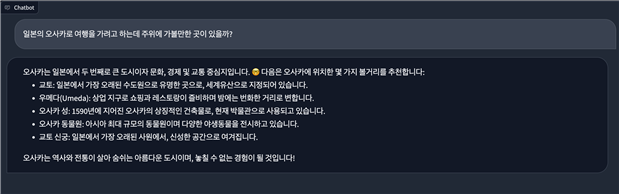

# 한밭대학교 컴퓨터공학과 AAI_AGAIN팀

**팀 구성**
- 20181602 최창수
- 20181632 임현석
- 20201752 이현서

## <u>Teamate</u> Project Background
- ### 필요성
  - 많은 빅테크 기업과 연구소는 한국어 기반 LLM을 출시하고 있지만 그에 따른 성능은 그다지 좋지 못한 편이다.
  - 이에 따라 사용자의 의도를 파악하고 응답하는 한국어, 영어 기반 Multi-lingual LLM을 개발한다.
  - 사용자의 편의성을 위해 해당 LLM을 Gradio를 활용해 웹 어플리케이션으로 배포한다
- ### 기존 해결책의 문제점
  - 기존의 Open-sourced MLLM은 Vocab에서 한국어가 차지하는 비율이 작다.
  - 또한, Pretrained된 데이터 중 89.7%가 영어 혹은 라틴 계열의 데이터로 학습되었다.
  
## System Design
  - ### System Requirements
    - OOO
    - OOO
## Model Architecture
  

    
  

  
  - 기존의 LLaMA2 vocabulary에 KoBERT vocaburaly를 병합하여 새로운 임베딩을 구축
  - 한국어, 영어 데이터를 7:3 비율로 총 33GB 추가 pretraining 진행
  - 고품질 한국어, 영어 Instruction 데이터 셋을 활용하여 Instruction Tuning
    
## Case Study
  - ### Word Embedding의 Vocaburaly를 확장
  
  
## Conclusion
  - 한국어에 대해 자연스러운 답변과 생성을 가능케하여 유용하고 맞춤화된 정보와 답변을 얻을 수 있다. 
  - LLM 웹 어플리케이션을 통해 한국어, 영어로 된 다양한 주제에 대해 질문, 설명, 가이드 등을 제공하여 학습과 정보 습득에 도움을 줄 수 있다.  
  - 해당 모델을 이용하여 차후 특정 Domain(ex. STEM, 의료, 법률 등)에 대해 fine-tuning을 진행하여  특정 분야에 특화된 LLM을 개발할 수 있다.  

  
   
  <b>GPT-4를 활용한 타 한국어 기반 LLM 과의 답변 생성 능력 평가 - 모델 업로드 기준(23년 10월) SOTA달성</b>

  
   
  <b>Gradio를 활용한 웹 어플리케이션</b>

  
## Project Outcome
- ### 20XX 년 OO학술대회 
